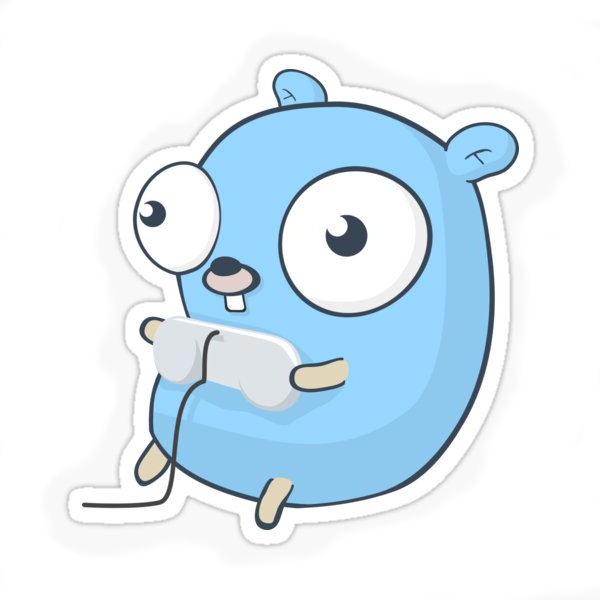

<h1 align="center">Hello, I'm Anton
    
</h1>

<h3>Languages:</h3>

<h3>My top langs</h3>

<h3>Tools I use:</h3>

<h3>Contacts:</h3>
<ul>
    <li>VK: https://vk.com/im?sel=436640806</li>
</ul>

<h3>Codewars:</h3>

   